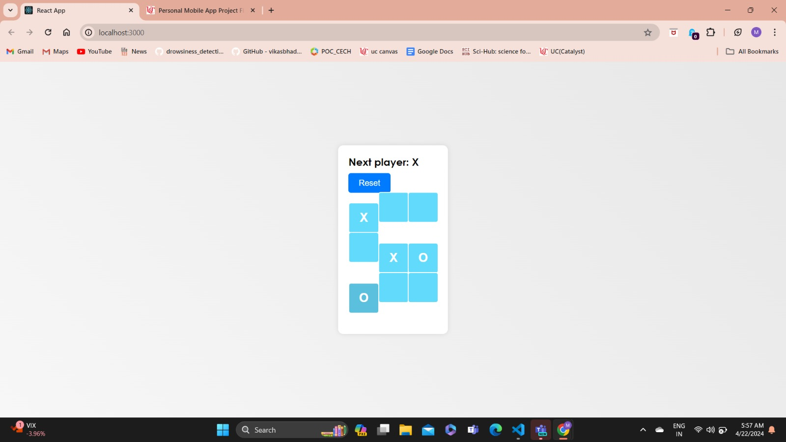

# Tech-For-Mobile-APPS-FINAL-PROJECT
# Tic-Tac-Toe Game in React Native

This is a simple implementation of the classic Tic-Tac-Toe game using React Native.

## Features

- Play Tic-Tac-Toe against a friend on the same device.
- Simple and intuitive user interface.
- Determines the winner and highlights the winning combination.
- Option to restart the game at any time.

## Technologies Used

- React Native
- Expo
- JavaScript

## How to Run

To run this project, follow these steps:

1. Ensure you have Node.js installed on your machine.
2. Clone this repository to your local machine.
3. Navigate to the project directory in your terminal.
4. Install dependencies using npm install or yarn install.
5. Start the Expo development server by running npm start or yarn start.
6. Use an Android or iOS emulator, or scan the QR code using the Expo Go app to run the app on your device.

## How to Play

1. Launch the application on your device.
2. The game will start with an empty 3x3 grid.
3. Player 1 (X) starts by tapping on any empty cell.
4. Player 2 (O) then taps on an empty cell.
5. Players take turns tapping on empty cells until one player wins or the game ends in a draw.
6. The game notifies the players of the winner or if it's a draw.
7. To restart the game, press the "Restart" button.

## Screenshots
# Tech-For-Mobile-APPS-FINAL-PROJECT
# Tic-Tac-Toe Game in React Native

This is a simple implementation of the classic Tic-Tac-Toe game using React Native.

## Features

- Play Tic-Tac-Toe against a friend on the same device.
- Simple and intuitive user interface.
- Determines the winner and highlights the winning combination.
- Option to restart the game at any time.

## Technologies Used

- React Native
- Expo
- JavaScript

## How to Run

To run this project, follow these steps:

1. Ensure you have Node.js installed on your machine.
2. Clone this repository to your local machine.
3. Navigate to the project directory in your terminal.
4. Install dependencies using npm install or yarn install.
5. Start the Expo development server by running npm start or yarn start.
6. Use an Android or iOS emulator, or scan the QR code using the Expo Go app to run the app on your device.

## How to Play

1. Launch the application on your device.
2. The game will start with an empty 3x3 grid.
3. Player 1 (X) starts by tapping on any empty cell.
4. Player 2 (O) then taps on an empty cell.
5. Players take turns tapping on empty cells until one player wins or the game ends in a draw.
6. The game notifies the players of the winner or if it's a draw.
7. To restart the game, press the "Restart" button.

## Screenshots
# Tech-For-Mobile-APPS-FINAL-PROJECT
# Tic-Tac-Toe Game in React Native

This is a simple implementation of the classic Tic-Tac-Toe game using React Native.

## Features

- Play Tic-Tac-Toe against a friend on the same device.
- Simple and intuitive user interface.
- Determines the winner and highlights the winning combination.
- Option to restart the game at any time.

## Technologies Used

- React Native
- Expo
- JavaScript

## How to Run

To run this project, follow these steps:

1. Ensure you have Node.js installed on your machine.
2. Clone this repository to your local machine.
3. Navigate to the project directory in your terminal.
4. Install dependencies using npm install or yarn install.
5. Start the Expo development server by running npm start or yarn start.
6. Use an Android or iOS emulator, or scan the QR code using the Expo Go app to run the app on your device.

## How to Play

1. Launch the application on your device.
2. The game will start with an empty 3x3 grid.
3. Player 1 (X) starts by tapping on any empty cell.
4. Player 2 (O) then taps on an empty cell.
5. Players take turns tapping on empty cells until one player wins or the game ends in a draw.
6. The game notifies the players of the winner or if it's a draw.
7. To restart the game, press the "Restart" button.

## Screenshots

